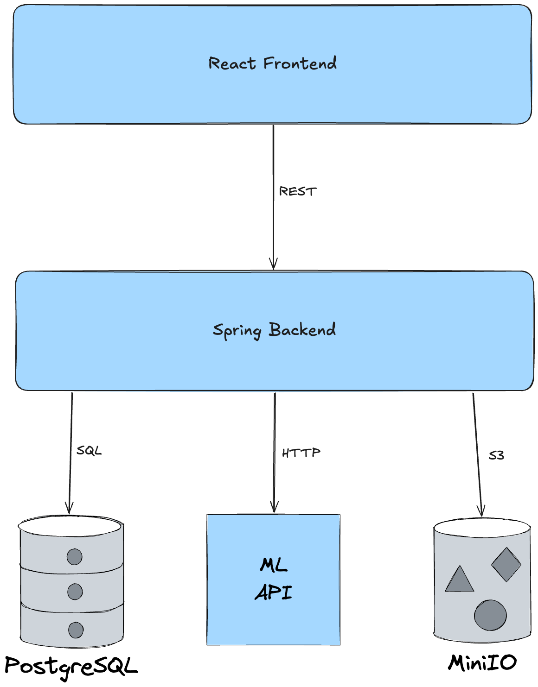
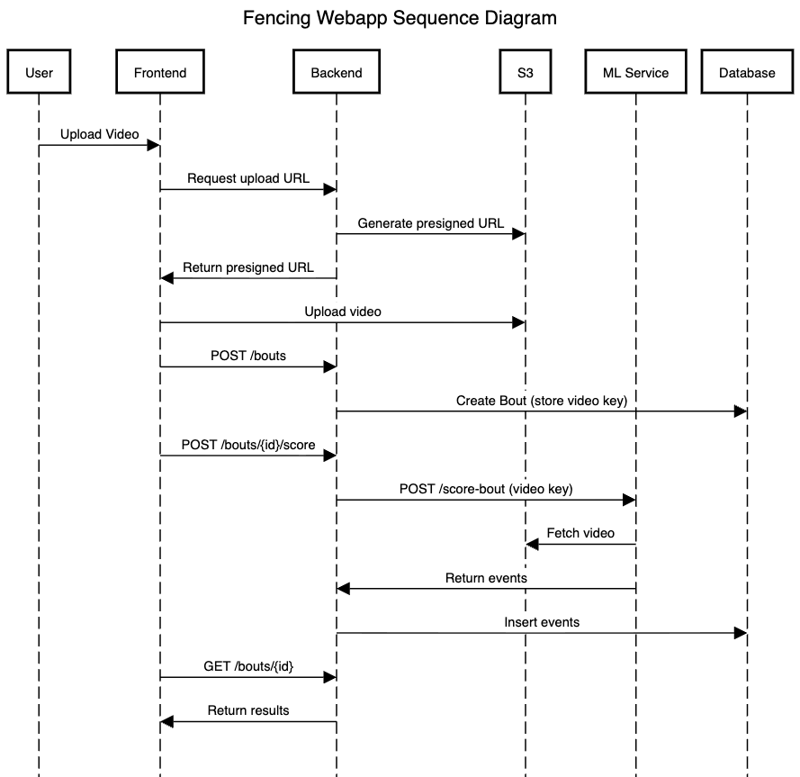
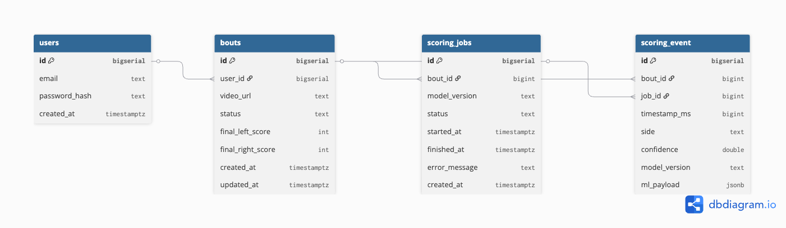

# Fencing Webapp 

This project is a full stack, production adaptation of my Fencing Referee project. 

You can find the deployment of this project at [fencing.cs.house](https://fencing.cs.house).

This app includes a React+Next.js frontend, a Java Spring Boot backend, a FastAPI ML service, a Postgres database, and an S3 Object Store (hosted with MinIO if ran locally).

## Getting Started

To run this application locally, make sure you have [Docker](https://www.docker.com/get-started/) installed.

Then, use docker compose to run all of the services together. 
```bash
docker compose up
```

After all the containers are running, you can access the web-interface from `localhost:3000` [(localhost)](http://localhost:3000).

## Application Components / Architecture

There are five components to the Fencing Referee web application:

- Frontend: Port 3000
  - React
  - Next.js
- Backend: Port 8080
  - Java
  - Spring Boot
- ML Service: Port 8000
  - Python 
  - FastAPI
  - PyTorch
  - OpenCV
- PostgreSQL Database: Port 5432
  - JDBC Driver
- S3 Object Storage: Ports 9000 + 9001
  - MinIO

### System Diagram



### Sequence Diagram



### Database Class Diagram



## Deployment

When deploying this application to the cloud, it is likely that docker compose will not work, so I would recommend deploying each service as a separate container under the same project workspace. 

### Order of Deployment
Some components rely on others, so it would be smart to first deploy the Postgres database and S3 object store, then the ML Service, then the Backend, and finally the Frontend. 

### Environmental Variables
There are also multiple environmental variables and secrets that need to be accessible to different parts of the deployment, so you should create some type of ConfigMaps or Secrets in your cloud environment:
- S3_ENDPOINT: URL that points to the S3 store
  - Backend
  - ML Service
- S3_ACCESS_KEY: Access key for the S3 store
  - Backend
  - ML Service
- S3_SECRET_KEY: Secret key for the S3 store
  - Backend
  - ML Service
- S3_BUCKET_VIDEOS: Bucket that stores the fencing videos
  - ML Service 
- S3_BUCKET_MODELS: Bucket that stores the AI models
  - ML Service
- DB_URL: URL pointing to the DB, should start with `jdbc:postgresql://`
  - Backend
- DB_USER: Username for database
  - Backend
- DB_PASSWORD: Password for database
  - Backend
- ML_SERVICE_URL: Service URL to the ML service. This does not need to be publicly available, but should refer to the service within the same cloud environment.
  - Backend
- NEXT_PUBLIC_API_URL: Public URL for the backend API. My deployment has a public route for this, but you might be able to refer to the service in the cloud environment.
  - Frontend
- CORS_ALLOWED_ORIGIN: URLs that should have access to the backend API, should include the public URL for the frontend.
  - Backend

### S3 Setup
In order for the ML Service to work as expected, two buckets must be created before deployment: one for fencing videos, and another for AI models.
- S3_BUCKET_VIDEOS
- S3_BUCKET_MODELS

You can create theses buckets with a simple Python script:
```python
import boto3

access_key = "example"
secret_key = "example"
s3_endpoint = 's3.example.com'

s3 = boto3.resource('s3', endpoint_url=s3_endpoint, aws_access_key_id=access_key, aws_secret_access_key=secret_key)

s3.create_bucket(Bucket="fencing-models")
s3.create_bucket(Bucket="fencing-videos")

print('bucket created.')
```

There will also likely be an issue with the CORS policy, in order to get around that, you will need to allow access to the S3 buckets for the frontend.
```python
import boto3

s3 = boto3.client(
    "s3",
    endpoint_url=s3_endpoint,
    aws_access_key_id=access_key,
    aws_secret_access_key=secret_key,
    region_name="us-east-1",
)

frontend_url = "frontend.com"

cors_config = {
    "CORSRules": [
        {
            "AllowedOrigins": [
                frontend_url,
                "http://localhost:3000"
            ],
            "AllowedMethods": [
                "GET",
                "PUT",
                "POST"
            ],
            "AllowedHeaders": ["*"],
            "ExposeHeaders": ["ETag"],
            "MaxAgeSeconds": 3000
        }
    ]
}

s3.put_bucket_cors(
    Bucket="fencing-videos",
    CORSConfiguration=cors_config
)

s3.put_bucket_cors(
    Bucket="fencing-models",
    CORSConfiguration=cors_config
)

print("CORS configuration applied.")
```
